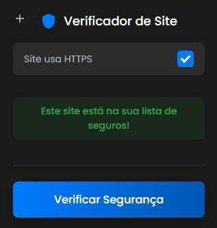

# Verificador de Site Seguro 🛡️


Uma extensão para o Google Chrome que permite ao usuário verificar se o site atual está em uma lista pessoal de sites confiáveis, garantindo uma navegação mais segura.

## 📸 Demonstração




## ✨ Funcionalidades

* **Verificação Instantânea:** Checa se a URL da página atual está na sua lista segura.
* **Lista Personalizável:** Adicione, visualize e remova sites da sua lista de confiança através de uma página de opções dedicada.
* **Indicador HTTPS:** Mostra claramente se o site atual utiliza uma conexão segura (HTTPS).
* **Interface Moderna:** Um design elegante com tema escuro, focado na usabilidade.
* **Persistência de Dados:** Suas URLs são salvas de forma segura usando a API `chrome.storage`.
* **Atalho Rápido:** Acesse a página de opções diretamente por um atalho no popup da extensão.


## 🚀 Instalação (Para Desenvolvedores)

Se você quiser testar ou modificar este projeto localmente, siga os passos:

1.  **Clone o repositório:**
    ```bash
    git clone [https://github.com/yjony/verificador-de-site.git](https://github.com/yjony/verificador-de-site.git)
    ```
    *(O link já está correto com seu usuário e repositório!)*

2.  **Abra o Google Chrome** e navegue até `chrome://extensions`.

3.  Habilite o **"Modo de desenvolvedor"** no canto superior direito.

4.  Clique em **"Carregar sem compactação"**.

5.  Selecione a pasta do projeto que você clonou.

A extensão aparecerá na sua barra de ferramentas, pronta para ser usada.


## 🛠️ Como Usar

1.  Clique no ícone **+** no canto superior esquerdo do popup para abrir a página de Opções.
2.  Na página de Opções, adicione um **Apelido** (ex: "Meu Banco") e a **URL** completa (ex: `https://www.meubanco.com.br`) do site que você confia.
3.  Quando estiver em um site, clique no ícone da extensão.
4.  Clique no botão **"Verificar Segurança"**.
5.  O resultado aparecerá, informando se o site está na sua lista e se ele usa HTTPS.


## 📁 Estrutura do Projeto

O projeto é organizado da seguinte forma para facilitar a manutenção e escalabilidade:
verificador-de-site/
├── assets/
│   ├── css/
│   ├── js/
│   └── images/
└── ... (arquivos html, json)
## 💻 Tecnologias Utilizadas

* HTML5
* CSS3
* JavaScript (ES6+)
* Chrome Extension APIs (Manifest V3)


## 📜 Licença

Este projeto está sob a licença MIT.
